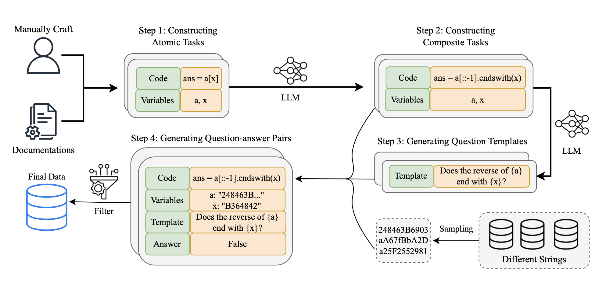
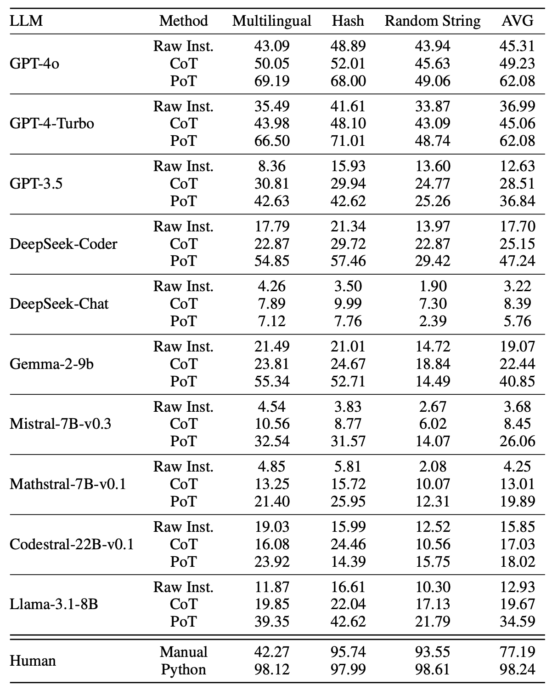

# [ICLR 2025] StringLLM
[StringLLM: Understanding the String Processing Capability of Large Language Models](https://arxiv.org/abs/2410.01208)

Xilong Wang, Hao Fu, Jindong Wang, Neil Zhenqiang Gong
## Overview
Let's get started by asking LLMs
```
How many 'r's are in the word 'strawberry'?
```

How well can LLMs understand strings and characters? This work presents a comprehensive study of LLMs' string processing capability. To this end, we build a series of datasets, stored in `data` folder. Our evaluations on these dataset indicate that LLMs struggle with accurately processing strings compared to humans. We subsequently propose an effective approach that significantly enhances LLMs' string processing capability via fine-tuning.

Here is a figure to briefly illustrate how StringLLM builds the benchmark datasets.


Here is a figure of evaluation results for string processing capability of humans and different LLMs.


## Usage
### Preparation
We recommend using Anaconda and execute the following commands.
```
conda create -n StringLLM python=3.11
conda activate StringLLM
pip install vllm
```
### Inference
The example commands for using open-source LLMs to run inference on our test sets are shown below:
```
cd inference
python infer_open_source_LLMs.py --dataset dataset_name --model_path your_model_path --method your_method
```
Make sure to specify the following key words when running inference:
1. `--dataset`: test set, which can be `hash`, `multilingual`, and `random_string`
2. `--model_path`: the local path of LLMs.
3. `--method`: prompt engineering techniques when prompting LLMs to inference on our test set, which can be `raw` (raw instructions), `pot` (PoT), `cot` (CoT).


### Evaluation
The code in `evaluation` folder is for running evaluation. For `raw` and `cot` method, run the following command:
```
cd evaluation
python compute_acc.py --dataset dataset_name --model_path your_model_path --method your_method
```
For `pot` method, run the following command:
```
cd evaluation
python compute_acc_code.py --dataset dataset_name --model_path your_model_path
```

### Fine-tuning LLMs on our datasets
Use the training sets in the `data/train` folder, and then follow the instruction of [Llama-Factory](https://github.com/hiyouga/LLaMA-Factory).

## Citation
If you find this work useful, please kindly cite
```
@article{wang2024stringllm,
  title={StringLLM: Understanding the string processing capability of large language models},
  author={Wang, Xilong and Fu, Hao and Wang, Jindong and Gong, Neil Zhenqiang},
  journal={arXiv preprint arXiv:2410.01208},
  year={2024}
}
```

## Acknowledgement
This repo benifits from [Llama-Factory](https://github.com/hiyouga/LLaMA-Factory) and the pre-trained models provided by [Hugging Face](https://huggingface.co).
